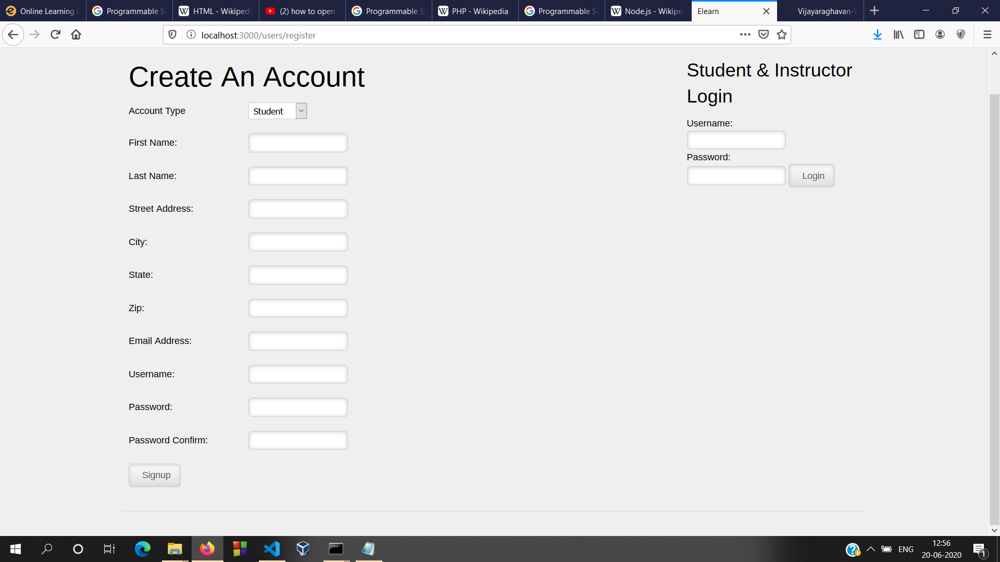

# ELearning-Website

This is an Elearning Website with Node-Js.

  

  
  <i>List of all classes</i>

  
  <i>Form for Signing Up</i>

  
  <i>Registration page for a class</i>
  <i>

  
  <i>Students My Classes Page</i>

  
  <i>Instructors My classes Page</i>

  
  <i>Adding lessons - Instructors Accessibility</i>

  
  <i>Database updation dynamically(Mongodb)<i>

## Status of the Project

#### What Works
 
- Some of the functions are 
* Validation of forms
* Students login
* Instructor login
* Users Joining new class
* Teachers Uploading notes to the class,etc. 

This created with Express framework , MongoDb as a server etc. 

####  Future Work

* Anyone can branch out and make it more interactive and send me pull request

